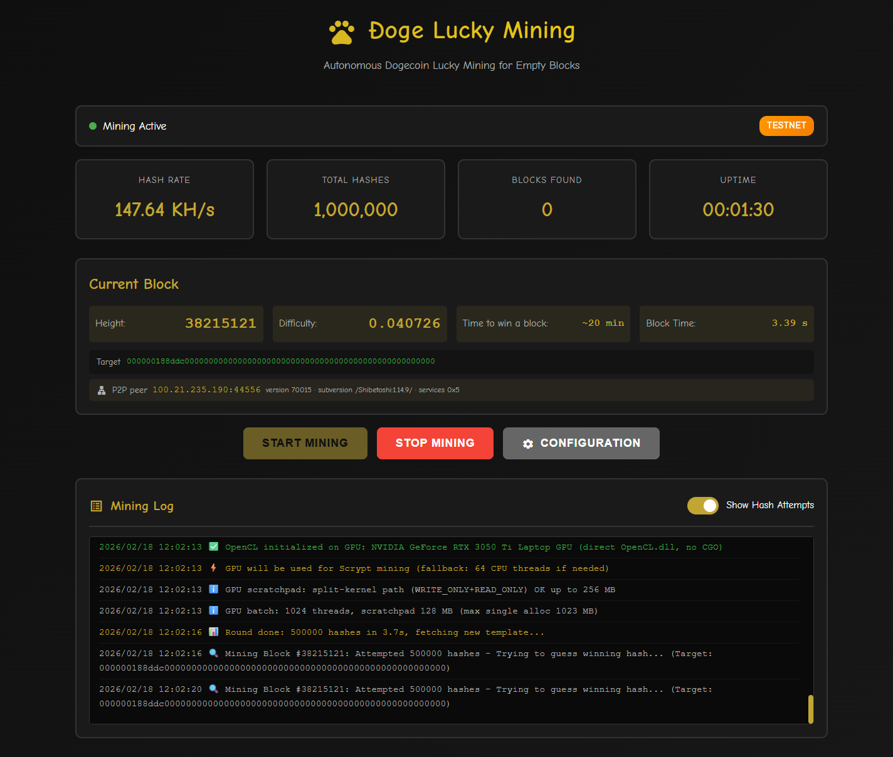

# Doge Lucky Mining



**Coded with love for the Dogecoin community ,open source.** 🐕

A **funny, silly, experimental** project that demonstrates current protocol realities: anyone can mine **empty blocks** on the Dogecoin network and skip validating transactions. This is a solo miner that builds blocks with **no transactions** (only the coinbase) and submits them over **pure P2P** or via a full node’s RPC.

**Use any normal computer** ,CPU or GPU ,with no special hardware. No pool, no account: just you and the chain.

---

## What is Doge Lucky Miner?

Doge Lucky Mining is a **solo Dogecoin miner** that:

- Mines **empty blocks** (block 10k coins reward only, zero transactions).
- Runs on **mainnet** or **testnet**.
- Works in two modes:
  - **Pure P2P** ,connect directly to the Dogecoin network. No full node, no Dogecoin Core, no RPC. Absolute solo mining.
  - **RPC** ,connect to an existing node (e.g. **Dogecoin Core**) and use it for the chain tip and block submission.
- **Optional address generation:** If you don’t have a payout address yet, the Configuration page can generate **mainnet** or **testnet** Dogecoin addresses for you. This uses **LibDogecoin** from the [Dogecoin Foundation](https://github.com/dogecoinfoundation/libdogecoin) (via the [dogeorg/doge](https://github.com/dogeorg/doge) Go library). You’ll see the public address and private key (WIF) and must store the private key safely; the app does not store it.

It uses your machine’s **CPU** (multi-threaded Scrypt) or **GPU** (OpenCL, **Windows builds only** in the current release). A web interface on port 42069 lets you configure and monitor everything.

---

## What is it for?

- **Experimentation and education** ,to show that the current protocol allows mining valid empty blocks and that validation of other people’s transactions is optional for miners.
- **Testing** ,testnet solo mining without running a full node.
- **Fun** ,a silly project to see “can I actually find a block from my laptop?”

It is **not** a "profit" tool; block discovery is a lottery. Treat it as a protocol experiment and a learning project.

---

## How it works

1. **Chain sync**
   - **P2P mode:** The miner connects to Dogecoin peers over the internet, fetches headers from a checkpoint (or genesis), and builds the current tip locally. No full node.
   - **RPC mode:** The miner asks your Dogecoin Core (or other RPC node) for the best block hash and builds the next block on top.

2. **Block template**
   - Builds a block with **only the coinbase** (reward to your payout address). No mempool, no transactions ,an empty block.

3. **Mining**
   - Solves the Scrypt PoW (same as Dogecoin): tries nonces until the block hash is below the network target. Uses either:
     - **CPU:** multiple threads (RFC 7914–style Scrypt) on all platforms, or  
     - **GPU:** OpenCL (e.g. NVIDIA/AMD) on **Windows** builds; Linux/macOS builds are CPU-only for now.

4. **Submission**
   - **P2P:** Sends the block over the same P2P connection (or broadcast peers).  
   - **RPC:** Submits the block via `submitblock` to your node.

If the block is accepted, the block reward goes to the **payout address** you configured (mainnet or testnet).

---

## Quick start

### 1. Get a binary (or build it)

**Pre-built binaries** are available in [GitHub Releases](https://github.com/qlpqlp/DogeLuckyMining/releases). Download the file for your OS:

- **Windows:** `dogelucky-windows-amd64.exe` (64-bit) or `dogelucky-windows-386.exe` (32-bit)
- **Linux:** `dogelucky-linux-amd64` or `dogelucky-linux-arm64`
- **macOS:** `dogelucky-darwin-amd64` (Intel) or `dogelucky-darwin-arm64` (Apple Silicon)

**Verify checksums (recommended):** Each release includes a `SHA256SUMS.txt` file. Compare the hash of your downloaded binary with the one in that file to confirm it was not modified. Example (Windows PowerShell): `Get-FileHash .\dogelucky-windows-amd64.exe -Algorithm SHA256`. On Linux/macOS: `sha256sum -c SHA256SUMS.txt` (after placing the file next to the downloaded binary).

**Or build from source:**

```bash
# Clone the repo
git clone https://github.com/qlpqlp/DogeLuckyMining.git
cd DogeLuckyMining

# Build for your current OS
go build -o dogelucky .

# Build for all supported OS/arch (for publishing: binaries go to dist/)
# On Windows (PowerShell):
.\build.ps1

# On Linux/macOS or Git Bash:
make build
```

The `dist/` folder will contain the six binaries plus **SHA256SUMS.txt** (checksums for each file so users can verify downloads). Upload all of these as GitHub Release assets.

### 2. Run and configure

1. Start the miner (e.g. double‑click the `.exe` on Windows, or `./dogelucky` on Linux/macOS).
2. The miner starts a web interface on **port 42069** (or the next free port if 42069 is in use). Your default browser should open automatically to **http://localhost:42069**. If it doesn’t, open that address in your browser.
3. On **first run**, the Configuration page opens with **Testnet** and **P2P only** pre-selected (no full node required). You **must** set:
   - **Payout address:** A valid testnet (n...) or mainnet (D...) address (required). If you don’t have one, use **Generate new address** in Configuration ,the app can generate mainnet or testnet addresses using **LibDogecoin** (Dogecoin Foundation). You’ll be shown the public address and private key; store the private key safely.
   - Optionally change **Network** or **Connection mode** (RPC if you use Dogecoin Core).
4. Save, then click **Start Mining**.

Mining runs in the background; the web UI shows hashrate, current block, and log. On testnet you can mine with CPU/GPU from a normal PC; on mainnet, finding a block is very unlikely but possible.

---

## Configuration (short reference)

| Setting            | Description |
|--------------------|-------------|
| **Network**        | Mainnet (real DOGE) or Testnet. |
| **Connection mode**| **P2P** = no node; **RPC** = use Dogecoin Core (or other) RPC. |
| **Payout address** | Where the block reward goes. **Required** for both networks. You can paste your own address or use **Generate new address** (optional). |
| **Generate new address** | Optional. Generates a mainnet or testnet Dogecoin address using **LibDogecoin** from the Dogecoin Foundation. Shows public address and private key (WIF); you must store the private key safely ,the app does not store it. |
| **Device type**    | CPU or GPU (OpenCL). GPU uses your normal drivers. |
| **Thread count**   | CPU threads (used when GPU is not used or as fallback). |
| **Mining intensity** | How many hashes per block (e.g. 50K–1M). |

- **P2P:** Optional checkpoint and peer override (e.g. testnet seed) for faster or more stable sync.  
- **RPC:** Set RPC URL, username, and password (e.g. from `dogecoin.conf`).

---

## How to help improve it

This is an experimental, open project. You can help by:

- **Reporting bugs** ,open an issue with steps and (if possible) log/output.
- **Suggesting features** ,e.g. UI, metrics, or protocol tweaks.
- **Contributing code** ,fix bugs, add options, or improve docs (PRs welcome).
- **Testing** ,try different OS, GPUs, and networks (especially testnet P2P) and share what works or breaks.

The stack is **Go** (no CGO for the miner core), **OpenCL** for GPU, and a small embedded web UI. Check the source and open issues/PRs on GitHub.

---

## Author / Credits

**Paulo Vidal** (Dogecoin Foundation Dev) ,coded with love for the Dogecoin community.

| | |
|---|---|
| **GitHub** | [github.com/qlpqlp](https://github.com/qlpqlp) |
| **Social (X)** | [x.com/inevitable360](https://x.com/inevitable360) |

---

## Important disclaimer

- This is a **silly, experimental** project to illustrate that the current Dogecoin (and similar) protocol allows **empty blocks** and does not force miners to validate other users’ transactions.
- **Not financial or mining advice.** On mainnet, block discovery is extremely unlikely on a normal PC; use testnet for learning and fun.
- **Payout address:** Use only addresses you control. Testnet coins have no real value.

---

## Summary

| Feature        | Description |
|----------------|-------------|
| **Hardware**   | Any normal computer ,CPU on all OS; GPU (OpenCL) on Windows builds. |
| **Solo mining**| Yes. No pool. |
| **Full node**  | Optional. **Pure P2P** = no node; **RPC** = use e.g. Dogecoin Core. |
| **Blocks**     | Empty blocks (coinbase only). |
| **Network**    | Dogecoin mainnet or testnet. |
| **Address generation** | Optional. Generate mainnet/testnet payout addresses in the UI using **LibDogecoin** (Dogecoin Foundation); you must store the private key safely. |

Build, run, point your browser at http://localhost:42069, set payout address and connection mode, and hit Start. Have fun and experiment responsibly.
